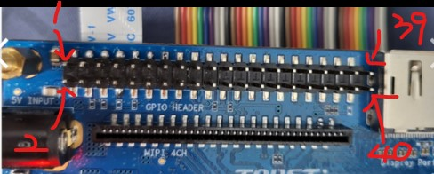
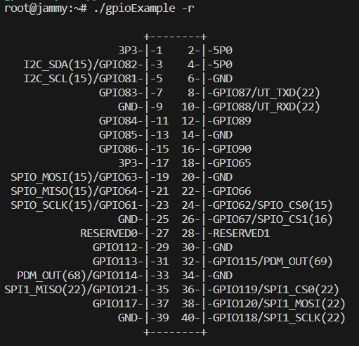

## 프로젝트 정보/ 요약

- GPIO 핀을 사용하여 LED로 신호등 구현
- TOPST 보드만으로 GPIO 컨트롤이 가능하다는 점을 나타낼 수 있음

## 소프트웨어 기능 리스트

- 파란색, 주황색, 빨간색 LED 각각 5, 2, 5초 점등

## 하드웨어 구성 리스트

- TOPOST 보드
- 파란색, 주황색, 빨간색 LED
- 암-수 점퍼 케이블
- 수-수 점퍼 케이블

## 프로그램 코드

- Git url: https://git.huconn.com/topst-project/traffic-lights-using-leds.git

파이썬 코드

```python
import os
import time

def export_gpio(gpio):
    gpio_path = f"/sys/class/gpio/gpio{gpio}"
    if not os.path.exists(gpio_path):
        try:
            with open("/sys/class/gpio/export", "w") as f:
                f.write(str(gpio))
        except IOError as e:
            print(f"Error exporting GPIO {gpio}: {e}")
            return False
    return True

def set_gpio_value(gpio, value):
    gpio_path = f"/sys/class/gpio/gpio{gpio}/value"
    with open(gpio_path, "w") as f:
        f.write(str(value))

def main():
    gpio_89 = 89
    gpio_90 = 90
    gpio_66 = 66

    if not export_gpio(gpio_89) or not export_gpio(gpio_90) or not export_gpio(gpio_66):
        return

    set_gpio_value(gpio_89, 0)
    set_gpio_value(gpio_90, 0)
    set_gpio_value(gpio_66, 0)

    try:
        while True:
            set_gpio_value(gpio_89, 1)
            time.sleep(5)

            set_gpio_value(gpio_89, 0)
            set_gpio_value(gpio_90, 1)
            time.sleep(2)

            set_gpio_value(gpio_90, 0)
            set_gpio_value(gpio_66, 1)
            time.sleep(5)

            set_gpio_value(gpio_66, 0)

    except KeyboardInterrupt:
        set_gpio_value(gpio_89, 0)
        set_gpio_value(gpio_90, 0)
        set_gpio_value(gpio_66, 0)

if __name__ == "__main__":
    main()
```

## 프로그램 동작 방법



*TOPST 2차 보드에서는 핀의 좌우가 바뀜



## 1. 핀 구성

TOPST 보드의 GPIO89, 90, 66핀 사용


| 갈색 | GROUND |
| --- | --- |
| 보라색 | GPIO89 |
| 회색 | GPIO90 |
| 파란색 | GPIO66 |


gpio 89, 90, 66핀에 각각 echo out > direction 입력

## 개발 완성품

파란색 LED 5초 점등


노란색 LED 2초 점등


빨간색 LED 5초 점등


<video src="video.mp4" controls title="Title"></video>

코드 과정에서 export와 unexport가 같이 이루어지므로 gpio핀을 따로 export 할 필요없음

*Keyboard Interrupt시 unexport 되므로 종료할 때 터미널 Control+C로 종료해야함

디버깅 중지로 종료시 수동삭제